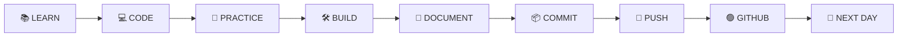
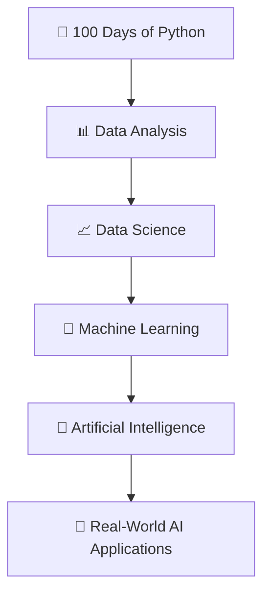

# 100 Days of Python 🐍

> **100 Days · 100 Challenges · 1 Goal — Master Python**

<p align="center">
  
</p>

<p align="center">
  <a href="#-challenge-dashboard"></a>
  <a href="#-progress-tracker"></a>
  <a href="#-learning-roadmap"></a>
  <a href="#-daily-coding-system"></a>
  <a href="https://github.com/yourusername/100-days-of-python/graphs/commit-activity"></a>
</p>

<p align="center">
  <b>Learn → Practice → Build → Document → Commit → Push → Repeat</b>
</p>

---

## 🚀 About This Challenge

Welcome to my **100 Days of Python** journey — a public commitment to mastering Python through consistent, daily practice.

For the next 100 days, I'm building a comprehensive learning log and portfolio covering everything from **Python fundamentals** to **data analysis**, **automation**, **APIs**, **databases**, and **AI/ML foundations**.

### 🎯 Why This Exists

| Reason | Impact |
|--------|--------|
| **Proof of Consistency** | Every folder = a day, every commit = progress |
| **Portfolio Building** | 100+ projects, challenges, and experiments |
| **Learning in Public** | Accountability + community feedback |
| **Foundation for AI/ML** | Strong Python base for Data Science & Machine Learning |

> **The goal isn't just 100 days.** The goal is to become confident enough to build real things.

---

## 📊 Challenge Dashboard

<div align="center">

| Metric | Current Progress |
|--------|------------------|
| 🗓️ **Total Days** | 100 |
| ✅ **Completed** | 01 |
| 🔥 **Current Streak** | 1 Day |
| 🧪 **Challenges** | 100+ |
| 🛠️ **Projects** | Growing |
| 🐍 **Primary Language** | Python |
| 🎯 **Final Goal** | Python + AI/ML |

</div>

### Current Progress

```
Day 01 / 100
████████████████████░░░░░░░░░░░░░░░░░░░░░ 1%
```

🔥 *Every completed day adds another block.*

---

## 🗺️ Learning Roadmap

The 100 days are structured in **5 progressive phases**, each building on the last:

### 🟢 Phase 1: Python Foundations (Days 1–20)
*Solid fundamentals — the bedrock of everything that follows*

| Day | Topic | Status | Key Concepts |
|-----|-------|--------|--------------|
| 01 | 🐍 Python Basics | 🟢 Complete | Syntax, variables, I/O, data types |
| 02 | ⚙️ Operators & Expressions | ⬜ Pending | Arithmetic, comparison, logical, bitwise |
| 03 | 🔤 Strings | ⬜ Pending | Formatting, methods, slicing, f-strings |
| 04 | 🔀 Conditional Statements | ⬜ Pending | if/elif/else, ternary, match-case |
| 05 | 🔁 Loops | ⬜ Pending | for, while, break, continue, else |
| 06 | 📋 Lists | ⬜ Pending | CRUD, slicing, methods, nesting |
| 07 | 📦 Tuples | ⬜ Pending | Immutability, unpacking, named tuples |
| 08 | 🔢 Sets | ⬜ Pending | Uniqueness, operations, frozenset |
| 09 | 📚 Dictionaries | ⬜ Pending | Key-value, methods, comprehension |
| 10 | ⚡ Functions | ⬜ Pending | Parameters, return, *args/**kwargs, docstrings |
| 11 | 🎯 Scope | ⬜ Pending | LEGB rule, global/nonlocal |
| 12 | 🔄 Recursion | ⬜ Pending | Base case, stack, memoization |
| 13 | 📦 Modules | ⬜ Pending | Import, `__name__`, stdlib |
| 14 | 🧩 Packages | ⬜ Pending | Structure, `__init__`, publishing |
| 15 | 🚨 Error Handling | ⬜ Pending | try/except/else/finally, custom exceptions |
| 16 | 🧪 Practice Problems | ⬜ Pending | LeetCode Easy, Edabit |
| 17 | 🧠 Problem Solving | ⬜ Pending | Algorithmic thinking |
| 18 | 🛠️ Mini Project | ⬜ Pending | CLI calculator / todo app |
| 19 | 🧪 Python Challenges | ⬜ Pending | 10+ coding challenges |
| 20 | 🏆 Foundations Project | ⬜ Pending | **Capstone: Personal Finance Tracker** |

### 🔵 Phase 2: Intermediate Python (Days 21–40)
*Object-oriented design, modern Python patterns, tooling*

| Day | Topic | Focus |
|-----|-------|-------|
| 21 | 📁 File Handling | Read/write, context managers, paths |
| 22 | 📄 Advanced File Ops | CSV, JSON, binary, large files |
| 23 | 🔗 JSON & Serialization | API responses, config files |
| 24 | 📊 CSV & Data Formats | pandas preview, data cleaning |
| 25 | 🏗️ OOP — Classes & Objects | Attributes, methods, dunder methods |
| 26 | 🧱 Constructors & `__init__` | Factory patterns, validation |
| 27 | 🧬 Inheritance | super(), MRO, abstract base classes |
| 28 | 🔄 Polymorphism | Duck typing, protocols, overloading |
| 29 | 🔒 Encapsulation | Properties, descriptors, slots |
| 30 | 🎯 Abstraction | ABCs, interfaces, design patterns |
| 31 | 🎨 Decorators | Function/class decorators, functools |
| 32 | 🔁 Iterators | `__iter__`, `__next__`, itertools |
| 33 | ⚡ Generators | yield, send, coroutines basics |
| 34 | 🧩 Comprehensions | List, dict, set, nested, walrus |
| 35 | 🗂️ Dict Comprehensions | Data transformation patterns |
| 36 | λ Lambda & Functional | map, filter, reduce, partial |
| 37 | 🌱 Virtual Environments | venv, conda, poetry, pipx |
| 38 | 📦 Package Management | pyproject.toml, dependencies, locking |
| 39 | 🧪 Intermediate Challenges | LeetCode Medium, Codewars |
| 40 | 🛠️ Intermediate Project | **Capstone: Task Manager CLI + API** |

### 🟣 Phase 3: Practical Python (Days 41–60)
*Real-world skills: APIs, automation, databases, CLI tools*

| Day | Topic | Focus |
|-----|-------|-------|
| 41 | 🌐 API Fundamentals | REST, GraphQL, HTTP verbs |
| 42 | 📡 HTTP Requests | requests, httpx, aiohttp, retries |
| 43 | 🔑 Authentication | API keys, OAuth2, JWT, sessions |
| 44 | 📦 JSON APIs | Pydantic models, validation |
| 45 | 🤖 Automation Basics | Scripting philosophy, scheduling |
| 46 | 📁 File Automation | watchdog, organize, backup |
| 47 | 🕷️ Web Scraping | BeautifulSoup, selectolax, ethics |
| 48 | 🔎 Regex | Patterns, groups, re.compile, flags |
| 49 | 🖥️ OS Automation | subprocess, shutil, pathlib, psutil |
| 50 | 🗄️ Database Fundamentals | Relational model, normalization |
| 51 | 🐬 SQL + Python | sqlite3, SQLAlchemy, asyncpg |
| 52 | 📊 Data Processing | ETL pipelines, batch vs stream |
| 53 | 💻 CLI Applications | click, typer, rich, argparse |
| 54 | 📧 Email Automation | smtplib, templates, attachments |
| 55 | 📅 Task Scheduling | cron, APScheduler, Celery basics |
| 56 | 🛠️ Automation Project | **Capstone: Auto-Job-Applier** |
| 57 | 🌐 API Project | **Capstone: Weather Dashboard API** |
| 58 | 🧪 Practical Challenge | Real-world problem solving |
| 59 | 🔧 Debugging & Profiling | pdb, logging, cProfile, memory |
| 60 | 🏆 Practical Python Project | **Capstone: Personal Productivity Suite** |

### 🟠 Phase 4: Python for Data & AI (Days 61–80)
*Data science stack + ML foundations*

| Day | Topic | Focus |
|-----|-------|-------|
| 61 | 🔢 NumPy Basics | Arrays, dtypes, vectorization |
| 62 | 🔢 NumPy Operations | Broadcasting, indexing, ufuncs |
| 63 | 🧮 NumPy Math | Linear algebra, random, FFT |
| 64 | 🐼 Pandas Basics | Series, DataFrame, IO |
| 65 | 📊 Data Selection | .loc, .iloc, query, xs |
| 66 | 🔍 Filtering & Boolean Indexing | Complex conditions, performance |
| 67 | 📈 Sorting, Grouping, Aggregation | pivot_table, crosstab, window |
| 68 | 🧹 Data Cleaning | Missing, duplicates, outliers, types |
| 69 | 🔄 Data Transformation | apply, map, pipe, melt, pivot |
| 70 | 📊 Exploratory Data Analysis | Profiling, correlation, insights |
| 71 | 📈 Matplotlib | Figures, axes, subplots, customization |
| 72 | 🎨 Seaborn | Statistical plots, themes, pairplot |
| 73 | 🔍 Advanced EDA | Missingno, sweetviz, ydata-profiling |
| 74 | 📐 Statistics Foundations | Descriptive, probability, distributions |
| 75 | 📊 Statistical Analysis | Hypothesis testing, confidence intervals |
| 76 | 🤖 ML Fundamentals | Supervised/unsupervised, bias-variance |
| 77 | 🧠 Scikit-learn Workflow | Pipelines, preprocessing, CV, metrics |
| 78 | 📈 Regression & Classification | Linear, logistic, trees, ensembles |
| 79 | 🧪 ML Challenge | Kaggle Titanic / House Prices |
| 80 | 🏆 Data & AI Project | **Capstone: End-to-End ML Pipeline** |

### 🔴 Phase 5: Projects & Mastery (Days 81–100)
*Portfolio-grade projects combining everything*

| Day | Project | Description |
|-----|---------|-------------|
| 81 | 🛠️ Python Project | Build a polished CLI tool from scratch |
| 82 | 🤖 Automation Project | Automate a real personal/workflow task |
| 83 | 🌐 API Project | Full-stack API with auth, docs, tests |
| 84 | 🗄️ Database Project | Multi-table app with migrations |
| 85 | 📊 Data Project | Analyze a real messy dataset (Kaggle) |
| 86 | 📈 Visualization Project | Interactive dashboard (Plotly/Streamlit) |
| 87 | 🧹 Data Cleaning Project | Real-world messy data → clean insights |
| 88 | 🧠 Problem Solving | Advanced algorithms, DP, graphs |
| 89 | 🤖 ML Project | Deploy a model with FastAPI + Docker |
| 90 | 🔥 Advanced Python | Metaclasses, descriptors, C extensions |
| 91 | 🌐 Real-World App | Full-stack: frontend + backend + DB |
| 92 | 🧪 Challenge Project | Complex multi-week problem |
| 93 | 📊 Data Science Project | End-to-end: question → insight → report |
| 94 | 🤖 AI/ML Project | LLM integration, RAG, or fine-tuning |
| 95 | 🛠️ Portfolio Project | GitHub-ready, documented, tested |
| 96 | 🔧 Optimization | Profiling, caching, async, Cython |
| 97 | 🧪 Final Challenge | Comprehensive synthesis challenge |
| 98 | 🏗️ Capstone Planning | Architecture, tech stack, milestones |
| 99 | 🚀 Capstone Development | Build the final project |
| 100 | 🏆 **FINAL CAPSTONE** | **Complete, document, publish, celebrate!** |

---

## 📅 Quick Progress Tracker

<details>
<summary><b>Click to expand full day-by-day tracker</b></summary>

| Range | Phase | Status |
|-------|-------|--------|
| Day 01 | 🟢 Python Basics | ✅ **Complete** |
| Day 02–20 | 🟢 Foundations | ⬜ Pending |
| Day 21–40 | 🔵 Intermediate | ⬜ Pending |
| Day 41–60 | 🟣 Practical | ⬜ Pending |
| Day 61–80 | 🟠 Data & AI | ⬜ Pending |
| Day 81–99 | 🔴 Projects | ⬜ Pending |
| Day 100 | 🏆 Final Capstone | ⬜ Pending |

</details>

---

## 🧩 What I'm Building

This challenge emphasizes **building over passive learning**. Every concept becomes working software.

| Area | Example Projects | Skills Demonstrated |
|------|------------------|---------------------|
| 🐍 **Python Core** | Calculators, games, utilities | Syntax, logic, stdlib |
| 📁 **Automation** | File organizers, backup scripts | OS, scheduling, monitoring |
| 🌐 **APIs** | Weather app, GitHub client, crypto tracker | HTTP, auth, async, Pydantic |
| 🗄️ **Databases** | CRUD apps, inventory, contacts | SQL, ORM, migrations |
| 📊 **Data Analysis** | Sales analysis, survey insights | Pandas, NumPy, statistics |
| 📈 **Visualization** | Interactive dashboards, reports | Matplotlib, Seaborn, Plotly |
| 🤖 **Machine Learning** | Price predictor, classifier, recommender | Scikit-learn, pipelines, eval |
| 🧠 **AI** | Chatbot, RAG system, agent | LLMs, embeddings, LangChain |

---

## 🔥 Daily Coding System

Every day follows a **structured development cycle** — no tutorials without code.



### 📌 Daily Checklist (Non-Negotiable)

| Step | Action | Evidence |
|------|--------|----------|
| 01 | 📚 **Learn** the concept | Notes in daily README |
| 02 | 💻 **Write** the code | `dayXX.py` with examples |
| 03 | 🧪 **Solve** practice problems | `challenges/` folder |
| 04 | 🛠️ **Build** something | `mini_project/` folder |
| 05 | 📝 **Document** learning | `README.md` per day |
| 06 | 📦 **Commit** changes | Meaningful commit messages |
| 07 | 🚀 **Push** to GitHub | Green squares every day |

---

## 📂 Repository Architecture

```
100-Days-of-Python/
│
├── 📁 Day-01/
│   ├── 🐍 day01.py              # Main implementation
│   ├── 🧪 challenges/           # Practice problems
│   │   ├── challenge_01.py
│   │   └── challenge_02.py
│   ├── 🛠️ mini_project/         # Applied project
│   │   └── main.py
│   └── 📖 README.md             # Daily documentation
│
├── 📁 Day-02/
│   ├── 🐍 day02.py
│   ├── 🧪 challenges/
│   ├── 🛠️ mini_project/
│   └── 📖 README.md
│
├── ... (through Day-100)
│
├── 🤖 automation/               # Cross-day automation scripts
├── 📊 data/                     # Datasets for analysis days
├── 🤖 ml/                       # ML models & experiments
├── 🌐 projects/                 # Larger multi-day projects
├── 📖 resources/                # Cheatsheets, references
├── 📄 README.md                 # This file
└── 🚫 .gitignore
```

### 📦 Daily Folder Structure

| Component | Purpose |
|-----------|---------|
| `dayXX.py` | Core concept implementation with examples |
| `challenges/` | 3–5 coding problems solved |
| `mini_project/` | Practical application of the day's topic |
| `README.md` | Structured daily log (see format below) |

---

## 📖 Daily README Format (Consistent & Searchable)

Every day follows this template for portfolio readiness:

```markdown
# Day XX — Topic Name

## 📚 What I Learned
- Key concept 1
- Key concept 2
- "Aha!" moments

## 🧠 Core Concepts
| Concept | Description | Code Example |
|---------|-------------|--------------|
| Concept | Explanation | `snippet()` |

## 💻 Code Highlights
```python
# Best snippet of the day
def highlight():
    pass
```

## 🧪 Challenges Solved
| # | Problem | Approach | Difficulty |
|---|---------|----------|------------|
| 1 | Two Sum | Hash map | Easy |

## 🛠️ Mini Project
**Project Name** — Brief description
- Feature 1
- Feature 2
- [Link to code](./mini_project/)

## 🐛 Bugs & Debugging
| Error | Cause | Fix | Lesson |
|-------|-------|-----|--------|
| TypeError | Forgot to cast | `int(input())` | Always validate input |

## 💡 Key Takeaways
1. Insight 1
2. Insight 2
3. Pattern to remember

## 🚀 What I Can Do Now
- [ ] Skill 1
- [ ] Skill 2
- [ ] Skill 3

## ⭐ Day XX Complete ✅
```

---

## 🛠️ Tech Stack

### 🐍 Programming & Development
<p align="center">
  
</p>

### 🔧 Version Control & Collaboration
<p align="center">
  
</p>

### 📊 Data Science & Visualization
<p align="center">
  
</p>

### 🤖 Machine Learning & Databases
<p align="center">
  
</p>

### 🌐 Web & APIs
<p align="center">
  
</p>

| Category | Technologies |
|----------|--------------|
| **Language** | Python 3.11+ |
| **IDEs** | VS Code, PyCharm, JupyterLab |
| **Version Control** | Git, GitHub, GitHub Actions |
| **Data** | NumPy, Pandas, Polars |
| **Visualization** | Matplotlib, Seaborn, Plotly, Altair |
| **ML/AI** | Scikit-learn, PyTorch, HuggingFace, LangChain |
| **Databases** | SQLite, PostgreSQL, Redis, DuckDB |
| **APIs** | FastAPI, HTTPX, Pydantic |
| **CLI** | Typer, Click, Rich, Textual |
| **Testing** | pytest, hypothesis, coverage |
| **Quality** | Ruff, Black, mypy, pre-commit |
| **Deployment** | Docker, Docker Compose, Railway |

---

## 🏆 Milestones & Celebrations

<div align="center">

| Milestone | Target | Achievement |
|-----------|--------|-------------|
| 🐣 **Day 01** | Start | ✅ **Done** — First commit! |
| 🔥 **Day 10** | Consistency | Habit formed, basics solid |
| ⚡ **Day 25** | Comfortable | Python feels natural |
| 🛠️ **Day 50** | Practical | Building real applications |
| 📊 **Day 75** | Data Confident | Analyzing, visualizing, modeling |
| 🤖 **Day 90** | AI/ML Ready | ML pipelines, LLM basics |
| 🏆 **Day 100** | **MASTERY** | Capstone published, portfolio ready |

</div>

---

## 🎯 Goals by Day 100

By the end of this challenge, I will be able to:

### ✅ Python Mastery
- [ ] Write clean, idiomatic, type-hinted Python
- [ ] Design classes using SOLID principles
- [ ] Debug efficiently with profiling tools
- [ ] Write comprehensive tests (unit, integration, property-based)

### ✅ Engineering Practices
- [ ] Structure projects with modern packaging (`pyproject.toml`)
- [ ] Use virtual environments & dependency locking
- [ ] Set up CI/CD with GitHub Actions
- [ ] Document code with docstrings + Sphinx/MkDocs

### ✅ Real-World Skills
- [ ] Build CLI tools people actually use
- [ ] Consume & create REST/GraphQL APIs
- [ ] Work with databases (SQL + ORM)
- [ ] Automate repetitive tasks reliably

### ✅ Data & AI Fluency
- [ ] Clean, explore, and visualize real datasets
- [ ] Build & evaluate ML models end-to-end
- [ ] Deploy models as APIs
- [ ] Understand LLM fundamentals & RAG

### ✅ Portfolio Outcomes
- [ ] 100+ daily commits with meaningful messages
- [ ] 5+ portfolio-ready projects
- [ ] 1 capstone project demonstrating full stack
- [ ] A GitHub profile that tells a story

---

## 🧠 Learning Philosophy

> **Consistency > Motivation > Perfection**

```
ERROR
  ↓
DEBUG
  ↓
UNDERSTAND
  ↓
FIX
  ↓
LEARN
  ↓
IMPROVE
```

### Core Principles

| Principle | Practice |
|-----------|----------|
| **Write, don't watch** | Every tutorial → code it yourself |
| **Small daily wins** | 30 min > 5 hours once a week |
| **Errors are teachers** | Document every bug & fix |
| **Build > Memorize** | Concepts stick when applied |
| **Public accountability** | Push daily, even if imperfect |

### The One Rule

> **Never skip the learning.**
> Even a 20-line script counts if it teaches something new.

---

## 📈 The Bigger Picture

This challenge is **Phase 1** of a longer technical journey:



**Objective:** Build a foundation strong enough to support advanced work in Data Science, ML, and AI Engineering.

---

## ⚡ The 100-Day Formula

```
100 DAYS
   ×
100 CHALLENGES
   ×
100+ CODING SESSIONS
   ×
COUNTLESS BUGS FIXED
   ↓
ONE STRONG PYTHON FOUNDATION
```

---

## 🌟 Start Here

### 📍 Current Journey
**Day 01 → Day 02 → Day 03 → … → Day 100**

### 🔗 Quick Links

| Resource | Link |
|----------|------|
| 🐍 **Current Day** | [Day 01](./Day-01/) |
| 📚 **All Days** | [Browse Repository](./) |
| 🤖 **Automation Scripts** | [/automation](./automation/) |
| 📊 **Datasets** | [/data](./data/) |
| 🤖 **ML Experiments** | [/ml](./ml/) |
| 🌐 **Major Projects** | [/projects](./projects/) |
| 📖 **Resources & Cheatsheets** | [/resources](./resources/) |

---

## 🤝 Connect & Follow

<p align="center">
  <a href="https://github.com/yourusername"></a>
  <a href="https://linkedin.com/in/yourprofile"></a>
  <a href="https://twitter.com/yourhandle"></a>
  <a href="mailto:your.email@example.com"></a>
</p>

---

<p align="center">
  
</p>

<p align="center">
  
</p>

---

<details>
<summary><b>📝 Changelog</b></summary>

| Date | Change |
|------|--------|
| 2025-01-XX | Initial repository structure created |
| 2025-01-XX | Day 01 completed — Python Basics |
| 2025-01-XX | README v2.0 — Enhanced structure & roadmap |

</details>

---

> **⭐ Star this repo** to follow the journey — or **fork it** to start your own 100-day challenge!
